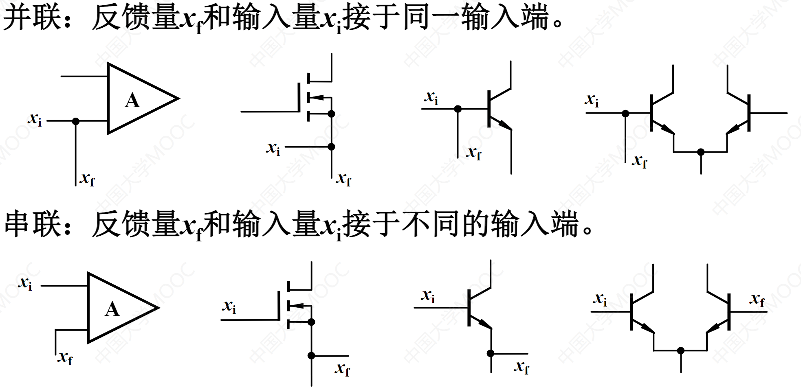
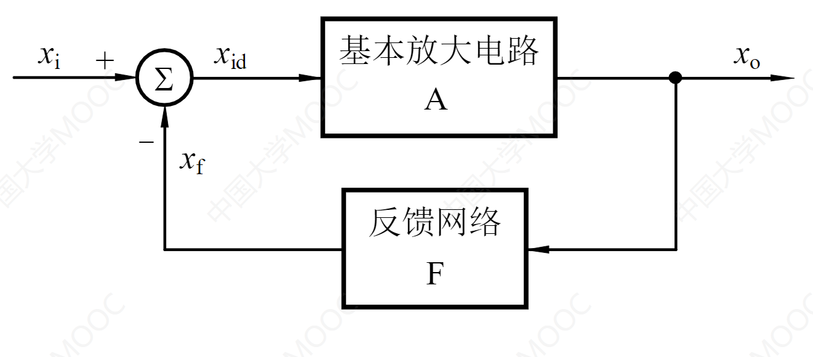
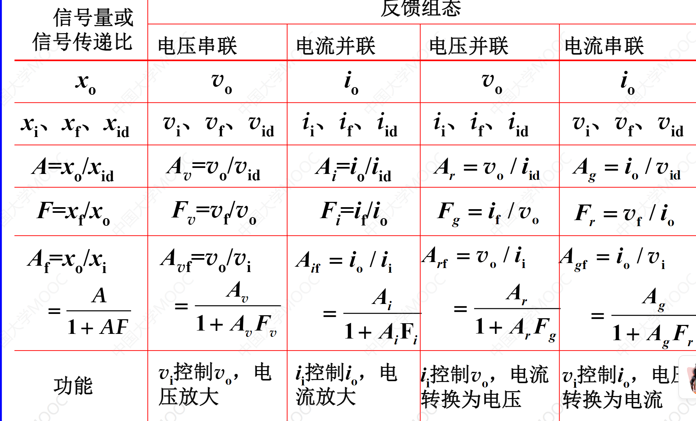

# 8.1 反馈的基本概念与分类
## 反馈的基本概念及直流、交流反馈
理想情况下，电源线和地线不是反馈电路。
## 串联反馈与并联反馈，电压反馈与电流反馈
串联反馈：输入、反馈、放大器并在一点
并联反馈：输入、反馈、放大器串在一条线上

对于电压信号源，引串联反馈效果更明显，串联反馈对理想电流信号源不起作用；对于电流信号源，引并联反馈效果更明显，并联反馈对理想电压信号源不起作用。

反馈和净输入在同一个输入端为并联反馈，在不同的输入端为串联反馈。

并联反馈可以电压取样，被称为电压反馈,电压负反馈具有稳定电压的作用；串联反馈可以电流取样，被称为电流反馈，电流负反馈具有稳定电流的作用。

==输出短路法==判断电压反馈还是电流反馈：输出电压调至0即短路，若反馈量为0，则为电压反馈，否则为电流反馈。

运放负载接地为电压反馈，负载悬浮即不接地为电流反馈。

观察电路形态，并联反馈为电压反馈，串联反馈为电流反馈。
### 基本放大器件反馈分类比较

## 正反馈与负反馈
负反馈：输入量不变时，引入反馈后输出量变小了
正反馈：输入量不变时，引入反馈后输出量变大了
瞬时极性：指某一时刻，电路中有关节点电压的斜率

BJT的集电极与基极信号的相位是相反的，集电极与发射极信号的相位是相同的；FET的漏极与栅极信号的相位是相反的，漏极与源极信号的相位是相同的；差分放大器的单端输出与输入信号的相位是相反的，差分输出与输入信号的相位是相同的。

## 负反馈放大电路的四种组态

四种分别为：串联-电压反馈、串联-电流反馈、并联-电压反馈、并联-电流反馈。

### 电压串联负反馈
特点：稳定输出电压，电压控制的电压源，电压/电压转换，电压放大器。
### 电压并联负反馈
特点：稳定输出电压，电流控制的电压源，电流/电压转换，互阻放大器。
### 电流串联负反馈
特点：稳定输出电流，电压控制的电流源，电压/电流转换，互导放大器。
### 电流并联负反馈
特点：稳定输出电流，电流控制的电流源，电流/电流转换，电流放大器。

# 8.2 负反馈放大电路增益的一般表达式
## 负反馈放大电路增益的一般表达式
开环增益：A=xo/xi
反馈系数：F=xf/xo
闭环增益：Af=xo/xi
负反馈电路的一般表达式：Af=A/(1+AF)
反馈深度：1+AF
环路增益：AF=xf/xid
（相量形式则反馈深度加绝对值）

当反馈深度大于1时，闭环增益的绝对值小于开环增益，一般为负反馈；
当反馈深度远远大于1时，深度负反馈，此时闭环增益的绝对值远远小于开环增益，近似为1/F；
当反馈深度小于1时，闭环增益的绝对值大于开环增益，一般为正反馈；
当反馈深度等于0时，闭环增益的绝对值趋向于无穷，自激振荡，此时无法正常工作。

四种组态的反馈系数有不同的量纲，电压/电压转换的增益无量纲，电流/电压转换的增益为欧姆，电压/电流转换的增益为西门子，电流/电流转换的增益无量纲。
